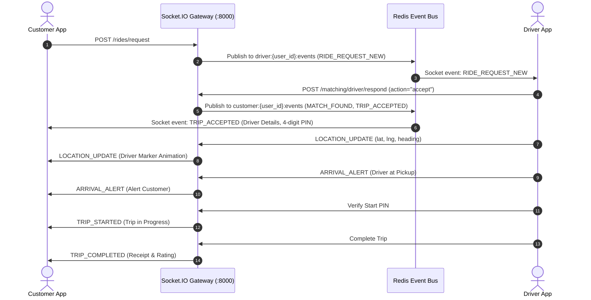

# Customer ↔ Driver Integration Contract

## 1. Booking Owner vs. Actual Rider Context (Feature 1 & Feature 3 Contract)

When a customer books a ride for themselves or for another person (Family Member or Guest):
1. **Account Owner Privacy**:
   - The account owner's payment card tokens, private profile addresses, and contact numbers remain completely unexposed to the driver.
2. **Operational Passenger Context**:
   - When `is_booked_for_other == true`:
     - Driver App receives `rider_name: "{rider_name} ({rider_type})"`.
     - In-app calling and SMS proxy mask the phone number to the actual passenger.
     - Ride Start PIN belongs to the passenger's mobile/app context.
3. **Safety & SOS Propagation**:
   - Both the actual rider and the account owner receive live GPS tracking and SOS trigger capability.
   - If an SOS event is triggered during the ride, registered primary emergency contacts receive immediate push notifications and SMS alerts with real-time location.

---

## 2. Vehicle Category & Driver Eligibility Mapping

| Backend Category | Eligible Vehicle Types (Driver App) | Minimum Driver Rating | Passenger Capacity | Base Fare & Surge Rule |
| :--- | :--- | :--- | :--- | :--- |
| **economy** | `HATCHBACK`, `MINI` | 4.0 ★ | 4 Seats | Base ₹50, ₹12/km, ₹1.5/min |
| **sedan** | `SEDAN` | 4.2 ★ | 4 Seats | Base ₹75, ₹16/km, ₹2.0/min, 1.1x Surge |
| **suv** | `SUV`, `TEMPO_TRAVELLER` | 4.5 ★ | 7 Seats | Base ₹110, ₹22/km, ₹3.0/min |
| **premium** | `SEDAN`, `SUV` (Executive class) | 4.7 ★ | 4 Seats | Base ₹150, ₹28/km, ₹4.0/min |
| **bike** | `BIKE` | 4.0 ★ | 1 Seat | Economy single-rider dispatch |
| **auto** | `AUTO` | 4.0 ★ | 3 Seats | City corridor dispatch |

---

## 3. Realtime Socket.IO Dispatch & Tracking Flow

---

## 4. Multi-Stop & Intermediate Waypoints
- Customer can configure up to `MAX_STOPS = 3` intermediate waypoints before booking confirmation.
- Driver App receives the full sequence of stops: `Pickup` $\rightarrow$ `Stop 1` $\rightarrow$ `Stop 2` $\rightarrow$ `Destination`.
- Stop progression is strictly driver/backend lifecycle controlled.

---

## 5. Advance Scheduled Reservation Contract (Feature 4 Contract)

### 1. Data Schema Transmission
When a customer creates an advance reservation:
- **Payload fields**:
  - `is_scheduled: true`
  - `scheduled_pickup_time: "2026-08-23T10:30:00Z"` (ISO-8601 UTC)
  - `scheduled_status: "CONFIRMED"`
  - `dispatch_buffer_minutes: 45`
  - `payment_method: "CASH" | "WALLET" | "UPI" | "SHARED_FAMILY"`

### 2. Driver Schedule Radar & Claim Flow (Driver Feature 26)
- **Advance Discovery**: Eligible drivers in the pickup zone see the ride under `GET /api/v1/matching/scheduled/available`.
- **Atomic Driver Claim**: Driver accepts via `POST /api/v1/matching/scheduled/{ride_id}/accept`. Row lock `SELECT FOR UPDATE` prevents duplicate claims.
- **Customer Notification**: Customer receives push alert: *"Driver Sunil S. (4.9 ★) reserved for your ride tomorrow at 10:30 AM"*.
- **Pre-Trip Dispatch Window**: 45 minutes before scheduled pickup time, driver receives departure reminder and calls `POST /api/v1/matching/scheduled/{ride_id}/start-heading`.
- **Live Transition**: Customer App transitions from reservation state to live tracking (`/track`) with driver GPS marker stream.

---

## 6. Real-Time Negotiation & Driver Counter-Offer Contract (Feature 5 Contract)

### 1. Customer Offer Broadcast
When customer negotiates fare:
- Customer creates ride with `pricing_mode = "NEGOTIATED"`, `customer_offer: 250`, `standard_fare: 280`.
- Broadcast to nearby PostGIS candidate drivers via Socket `RIDE_OFFER` event with `is_negotiation: true` and `customer_offer: 250`.

### 2. Driver Response Options
Driver App responds with structured action:
1. `ACCEPT`: Driver accepts proposed amount (`amount: 250`).
2. `COUNTER`: Driver proposes counter amount within allowed range (`amount: 270`).
3. `REJECT`: Driver declines proposal (`status: REJECTED`).

### 3. Customer Comparison & Atomic Driver Assignment
- Customer App compares live incoming offers: Driver Rating, Vehicle Model, Arrival ETA, and Price.
- Customer taps `Accept & Ride (Driver C for ₹240)`:
  - Atomic backend transaction sets `RideRequest.assigned_driver_id = Driver C.id`, `RideRequest.estimated_fare = 240`, `status = 'ASSIGNED'`.
  - Invalidate all competing offers (`RideOfferStatus.SUPERSEDED`).
  - Driver C receives `OFFER_CONFIRMED` event.
  - Customer App redirects to Live Tracking (`/track`).

---

## 7. Live Driver Tracking & Telemetry Contract (Feature 6 Contract)

### 1. Ingestion Pipeline
- **Driver GPS Source**: Driver App broadcasts foreground/background GPS via `POST /api/v1/matching/rides/{ride_id}/location`.
- **Payload**: `{ latitude: float, longitude: float, heading: float, speed: float, timestamp: string }`.
- **Backend Distribution**: Backend updates Redis `driver:{driver_id}:location` cache and emits Socket event `LOCATION_UPDATE` to room `ride:{ride_id}`.
- **Cost Guard**: Customer App consumes the location stream locally without executing third-party routing or map API calls per GPS frame.

### 2. State Synchronization
- **Arrival Detection**: Backend PostGIS geofence evaluates pickup proximity ($\le 50$ meters) and emits `ARRIVAL_ALERT` when driver arrives.
- **Boarding Security**: Driver enters customer's `start_pin` via `POST /api/v1/matching/rides/{ride_id}/start`. On match, backend emits `TRIP_STARTED`.
- **Destination Progression**: Upon `TRIP_STARTED`, Customer App switches map focus and polyline from pickup to destination.
- **Trip Completion**: Driver completes trip via `POST /api/v1/matching/rides/{ride_id}/complete`. Backend emits `TRIP_COMPLETED`, terminates tracking telemetry, closes the Socket room, and routes customer to receipt/rating.

---

## 8. Pickup / Start Ride & During Ride Lifecycle Contract (Feature 7 & 8 Contract)

### 1. Pickup Verification & Boarding Authentication (Feature 7)
- **Arrival Detection**: Backend PostGIS geofence ($\le 100\text{m}$) $\rightarrow$ Socket event `ARRIVAL_ALERT`.
- **Vehicle Verification**: Customer inspects displayed vehicle information (Make, Model, Color, Registration Number) against physical vehicle.
- **Wrong Driver / Vehicle Incident Flow**:
  - Customer taps *"Wrong vehicle or driver? Report"* $\rightarrow$ opens report modal $\rightarrow$ `POST /api/v1/matching/rides/{ride_id}/pickup-issue` `{ issue_type: 'WRONG_VEHICLE' | 'WRONG_DRIVER' | 'UNSAFE', notes: string }`.
  - Backend flags ride for moderation review and dispatches safety alert.
- **Start PIN Verification**:
  - Customer reveals 4-digit `start_pin` (`4921`) to driver inside cab.
  - Driver submits PIN via `POST /api/v1/matching/rides/{ride_id}/start` `{ pin: "4921", lat, lng }`.
  - Backend performs atomic `SELECT FOR UPDATE` verification and PostGIS proximity check.
  - On success, backend sets `status = 'IN_PROGRESS'`, sets `started_at = now()`, and emits `TRIP_STARTED` to ride room.

### 2. During Ride Execution & In-Flight Waypoints (Feature 8)
- **Add Intermediate Stop**:
  - Customer adds stop via `POST /api/v1/matching/rides/{ride_id}/stops` `{ address, latitude, longitude }`.
  - Backend enforces maximum 3 intermediate stops constraint and applies $+₹30$ base stop fee.
  - Backend emits `STOP_ADDED` $\rightarrow$ Driver App updates waypoint navigation; Customer UI adds stop marker.
- **Modify Destination**:
  - Customer/Driver modifies destination via `POST /api/v1/matching/rides/{ride_id}/destination`.
  - Backend recalculates road distance and live fare delta $\rightarrow$ emits `DESTINATION_UPDATED` to ride room.
- **Live Waiting Status**:
  - Driver triggers waiting $\rightarrow$ Backend starts timer $\rightarrow$ emits `WAITING_STARTED` / `PAID_WAITING_STARTED`.
  - Customer UI displays real-time timer with accumulated waiting charges.
- **Realtime Toll Ingestion**:
  - Express tolls encountered $\rightarrow$ backend adds amount $\rightarrow$ emits `TOLL_ADDED` $\rightarrow$ Customer UI renders toll notice banner.
- **Masked Passenger ↔ Driver Communication**:
  - Real-time in-app chat via `POST /api/v1/matching/communication/messages` $\rightarrow$ Socket `NEW_CHAT_MESSAGE`.
  - Masked proxy calling via `POST /api/v1/matching/communication/calls/initiate`.
- **Safety Suite & Live Trip Sharing**:
  - Emergency SOS dialer launches `tel:112` and calls `POST /api/v1/matching/rides/{ride_id}/sos` (alerts emergency contacts).
  - Short-lived tokenized URL (`https://cab.app/track/{token}`) generated via `POST /api/v1/safety/rides/{ride_id}/share` with 3-hour expiration.
