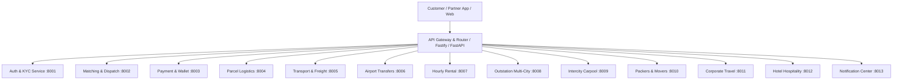

# 📡 SUPERAPP API CONTRACT MATRIX (PHASE 1 – 25)

---

## 🌐 1. MASTER API CONTRACT SPECIFICATION

---

## 📋 2. SERVICE ENDPOINT SPECIFICATIONS & VERIFIED STATUS

| Vertical / Service | Endpoint Path | Method | Payload / Validation | Authoritative Response | Status |
|:---|:---|:---:|:---|:---|:---:|
| **Auth & KYC** | `/api/v1/auth/driver/kyc/upload` | `POST` | `driver_id`, `doc_type`, `file_path`, `media_asset_id` | Document version + approval status | `VERIFIED` |
| **Cab Matching** | `/api/v1/matching/request-ride` | `POST` | `pickup_lat`, `pickup_lng`, `drop_lat`, `drop_lng`, `tier` | `ride_id`, `estimated_fare`, `status: SEARCHING` | `VERIFIED` |
| **Cab Dispatch** | `/api/v1/matching/offers/{id}/respond` | `POST` | `offer_id`, `driver_id`, `action: ACCEPT/REJECT` | Atomically assigns ride or removes offer | `VERIFIED` |
| **Parcel Delivery**| `/api/v1/parcels/orders` | `POST` | `sender`, `receiver`, `weight_kg`, `category`, `fragile` | `tracking_number`, `pickup_otp`, `delivery_otp` | `VERIFIED` |
| **Parcel POD** | `/api/v1/parcels/{id}/verify-delivery-otp` | `POST`| `delivery_otp`, `signature_url`, `photo_url` | `status: DELIVERED`, credits wallet | `VERIFIED` |
| **Freight Quote** | `/api/v1/transport/orders/{id}/quotes` | `POST` | `amount`, `vehicle_id`, `helpers_count`, `eta_min` | `quote_id`, `status: SUBMITTED` | `VERIFIED` |
| **Freight Counter**| `/api/v1/transport/quotes/{id}/counter` | `POST` | `counter_amount`, `actor_type: CUSTOMER/TRANSPORTER` | Updates quote & creates audit event | `VERIFIED` |
| **Airport Flight** | `/api/v1/airport/flights/{no}/lookup` | `GET` | `flight_number`, `flight_date` | Live status, terminal, gate, baggage belt | `VERIFIED` |
| **Hourly Rental** | `/api/v1/rental/bookings` | `POST` | `plan_id`, `pickup_lat`, `pickup_lng`, `stops` | `booking_ref`, `actual_start_time` (server) | `VERIFIED` |
| **Outstation** | `/api/v1/outstation/bookings` | `POST` | `journey_type: ROUND_TRIP`, `legs`, `night_halts` | Multi-leg voucher + daily allowances | `VERIFIED` |
| **Carpool Publish**| `/api/v1/carpool/trips` | `POST` | `origin`, `destination`, `waypoints`, `seats`, `price` | `trip_id`, `available_seats: 3` | `VERIFIED` |
| **Carpool Reserve**| `/api/v1/carpool/trips/{id}/reserve` | `POST` | `requested_seats`, `payment_method` | Locks seats transactionally; emits `PBK-XXX` | `VERIFIED` |
| **Packers Movers** | `/api/v1/packers/orders` | `POST` | `size: 2_BHK`, `items`, `floor_no_lift`, `assembly` | Relocation estimate + inventory checklist | `VERIFIED` |
| **Corporate Travel**| `/api/v1/corporate/travel-requests`| `POST` | `company_id`, `cost_center`, `fare`, `service_type` | Auto-approves or creates manager task | `VERIFIED` |
| **Hotel Hub** | `/api/v1/hotel/bookings` | `POST` | `hotel_id`, `room_type_id`, `check_in`, `check_out` | Isolated QR voucher (zero driver radar leak) | `VERIFIED` |
| **Emergency SOS** | `/api/v1/safety/sos/trigger` | `POST` | `user_id`, `ride_id`, `latitude`, `longitude` | Idempotent response + Police 112 dispatch | `VERIFIED` |
| **Notification Feed**| `/api/v1/notifications` | `GET` | `category`, `unread_only`, `page`, `limit` | Paginated notification items + unread count | `VERIFIED` |
