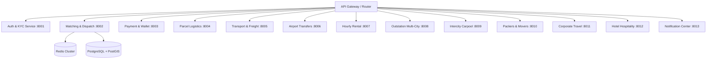

# ⚙️ BACKEND MICROSERVICES MASTER DEVELOPMENT & AUDIT LOG

---

## 🚀 1. BACKEND MICROSERVICES ARCHITECTURE

---

## 📋 2. VERIFIED BACKEND SUBSYSTEMS & CAPABILITIES

1. **Auth & KYC Service (:8001)**: Phone OTP validation, JWT auth, cryptographic device trust, Cloudinary asset versioning, KYC dashboard calculation.
2. **Matching & Dispatch (:8002)**: PostGIS spatial matching (`ST_DWithin`), Uber H3 indexing, 15-second atomic fanout, transactional row locks (`with_for_update()`).
3. **Payment & Wallet (:8003)**: Double-entry ledger (`driver_earning_ledger`), multi-bucket customer funds, idempotency key deduplication, 85/15 fare split.
4. **Parcel Logistics (:8004)**: 2-phase distinct random OTPs (Sender Pickup & Receiver Delivery), Cloudinary POD signature & photo storage.
5. **Transport & Freight (:8005)**: Volumetric dimensional quoting (CFT), commercial truck requirements, multi-carrier bidding and interactive counter-offers.
6. **Airport Service (:8006)**: Live flight schedule tracking (AI123), +35 min delay auto-recalculation, 45-min terminal grace period.
7. **Rental Service (:8007)**: 1h/10km to 8h/80km plans, server-timestamp duration authority, dynamic multi-stop waypoints, overage calculation.
8. **Outstation Service (:8008)**: One-way, round-trip, multi-city itineraries, daily driver allowances, night halts, customer-approved Fastag toll charges.
9. **Carpool Service (:8009)**: Intercity corridor publishing, transactional seat inventory locking, overbooking prevention, CO2 emission analytics.
10. **Packers & Movers (:8010)**: 2 BHK inventory checklist, 4-person crew allocation, 5-stage relocation state machine, zero-damage signoff.
11. **Corporate Service (:8011)**: Department cost centers (CC-ENG-904), auto-approve thresholds vs manager approvals, monthly consolidated GST invoices.
12. **Hotel Service (:8012)**: 5-star hotel discovery, 12% GST room booking, front desk check-in roster, complete isolation from driver dispatch radar.
13. **Notification Service (:8013)**: Categorized notification inbox, unread badge counter, zero-duplicate Socket + FCM delivery.
