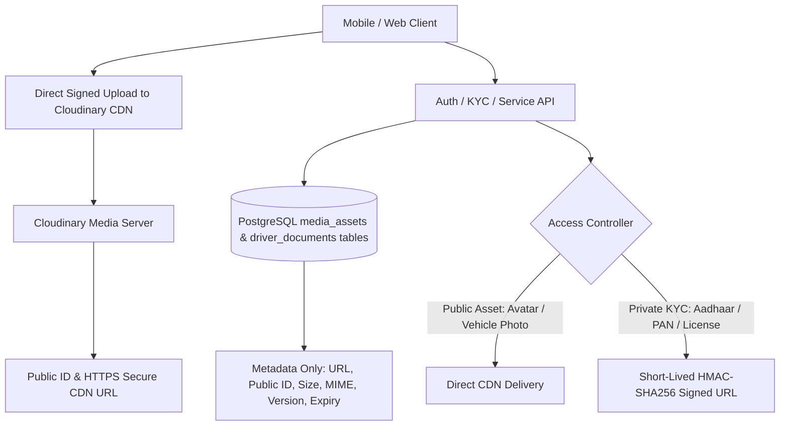

# ☁️ CLOUDINARY STORAGE & MEDIA ARCHITECTURE (PHASE 1 – 25)

---

## 🖼️ 1. SECURE CDN & ASSET STORAGE PIPELINE

---

## 🔒 2. ASSET SECURITY & ISOLATION POLICIES

1. **Zero Raw Binary in PostgreSQL:** Binary image bytes are never stored in the database. PostgreSQL stores strictly structured metadata (`media_assets`, `driver_documents`, `vehicle_documents`).
2. **Short-Lived HMAC Signed URLs:** Private identity assets (Aadhaar, Driving License, RC) generate short-lived signed URLs with 15-minute expirations.
3. **Cross-Tenant IDOR Shield:** Customer users are blocked from querying driver KYC documents (HTTP 403). Drivers can only view and update their own document records.
4. **Version Incrementing:** Re-uploading a document archives the previous version and increments the version counter without overwriting audit history.
