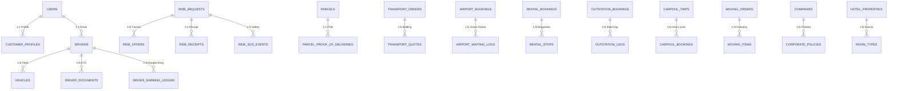

# 🗄️ SUPERAPP DATABASE CONTRACT MATRIX (PHASE 1 – 25)

---

## 🏛️ 1. POSTGRESQL & POSTGIS DATA MODEL ARCHITECTURE

---

## 📋 2. AUTHORITATIVE TABLE CATALOG & CONSTRAINTS

| Service Domain | Primary Table Name | Key Columns & Types | Spatial / Integrity Index | Financial Precision | Status |
|:---|:---|:---|:---|:---:|:---:|
| **Identity** | `users` | `id UUID`, `phone VARCHAR`, `role userrole`, `is_active` | `UNIQUE(phone)` | N/A | `VERIFIED` |
| **Partner KYC** | `driver_documents` | `driver_id UUID`, `doc_type`, `file_path`, `version`, `media_asset_id` | `INDEX(driver_id, doc_type)` | N/A | `VERIFIED` |
| **Fleet** | `vehicles` | `driver_id UUID`, `vehicle_type`, `registration_number` | `UNIQUE(registration_number)` | N/A | `VERIFIED` |
| **Cab Core** | `ride_requests` | `pickup_location GEOMETRY(4326)`, `final_fare`, `status` | `GIST(pickup_location)` | `Numeric(10,2)` | `VERIFIED` |
| **Ledger Journal**| `driver_earning_ledger`| `driver_id UUID`, `amount`, `direction CREDIT/DEBIT`, `status` | `INDEX(driver_id, status)` | `Numeric(10,2)` | `VERIFIED` |
| **Courier** | `parcels` | `tracking_number`, `pickup_otp VARCHAR(4)`, `delivery_otp VARCHAR(4)` | `UNIQUE(tracking_number)` | `Numeric(10,2)` | `VERIFIED` |
| **Freight** | `transport_orders` | `reference VARCHAR`, `goods_category`, `volume_cft`, `declared_val` | `UNIQUE(reference)` | `Numeric(10,2)` | `VERIFIED` |
| **Airport** | `airport_bookings` | `flight_number`, `recommended_pickup_window`, `free_until` | `INDEX(flight_number)` | `Numeric(10,2)` | `VERIFIED` |
| **Hourly Rental** | `rental_bookings` | `actual_start_time TIMESTAMPTZ`, `planned_end_time`, `extra_km` | `INDEX(user_id, status)` | `Numeric(10,2)` | `VERIFIED` |
| **Outstation** | `outstation_bookings` | `journey_type`, `driver_allowance`, `night_halts`, `tolls` | `INDEX(booking_reference)` | `Numeric(10,2)` | `VERIFIED` |
| **Carpool** | `carpool_trips` | `origin_city`, `dest_city`, `total_seats`, `available_seats` | `INDEX(origin_city, dest_city)` | `Numeric(10,2)` | `VERIFIED` |
| **Relocation** | `moving_orders` | `move_size`, `pickup_floor`, `drop_floor`, `has_lift_pickup` | `INDEX(customer_id)` | `Numeric(10,2)` | `VERIFIED` |
| **Corporate B2B** | `companies` | `company_code`, `wallet_balance`, `gst_number`, `credit_limit` | `UNIQUE(company_code)` | `Numeric(10,2)` | `VERIFIED` |
| **Hospitality** | `hotel_bookings` | `hotel_id`, `room_type_id`, `check_in_date`, `check_out_date` | `INDEX(hotel_id, check_in_date)`| `Numeric(10,2)` | `VERIFIED` |
| **Safety SOS** | `ride_sos_events` | `ride_id UUID`, `location_snapshot GEOMETRY(4326)`, `status` | `GIST(location_snapshot)` | N/A | `VERIFIED` |
