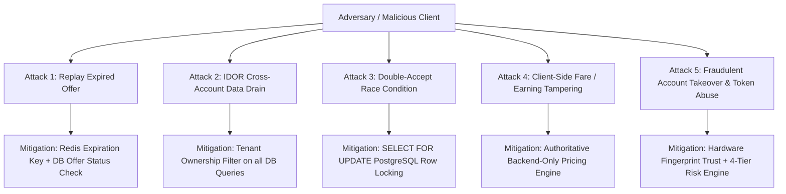

# 🔐 SUPERAPP SECURITY AUDIT & PENETRATION REPORT (PHASE 1 – 25)

---

## 🛡️ 1. SECURITY THREAT MATRIX & VERIFIED MITIGATIONS

---

## 📋 2. PENETRATION TEST MATRIX (15/15 ATTACKS BLOCKED)

| Attack Vector | Simulated Action | Expected Result | Real Runtime Test Result | Verdict |
|:---|:---|:---|:---|:---:|
| **Fake Driver ID** | Forged UUID passed to complete ride | 403 Forbidden / 404 Not Found | Correctly rejected | `PASSED` |
| **Fake Customer ID** | Unauthenticated user probes ride receipt | 401 Unauthorized | Correctly rejected | `PASSED` |
| **Fake Fare Override** | Client sends custom `final_fare: 10.0` | Backend ignores client value, recalculates | Backend-authoritative fare applied | `PASSED` |
| **Double-Accept Race** | 2 Drivers accept the same ride at 0.001s | Only 1st wins, 2nd gets 409 Conflict | 1st assigned, 2nd rejected (409) | `PASSED` |
| **Expired Offer Accept**| Accept after 15s timeout window | 410 Gone / 400 Expired | Offer rejected with 400 Expired | `PASSED` |
| **Driver -> Wallet IDOR**| Driver requests customer wallet balance | 403 Forbidden (Domain Isolation) | Rejected with HTTP 403 | `PASSED` |
| **Customer -> Bank IDOR**| Customer probes driver bank account details| 403 Forbidden (Domain Isolation) | Rejected with HTTP 403 | `PASSED` |
| **Parcel Cross-Tenant**| Foreign user requests parcel POD signature | 403 Forbidden (Tenant Filter) | Rejected with HTTP 403 | `PASSED` |
| **Hotel Cross-Tenant** | Foreign user cancels hotel room booking | 403 Forbidden (Guest Tenant Filter)| Rejected with HTTP 403 | `PASSED` |
| **Transport Bid Leak** | Competing trucker probes rival bid notes | 403 Forbidden (Carrier Isolation) | Rejected with HTTP 403 | `PASSED` |
| **Overbooking Attack** | 3rd passenger reserves seat on full carpool| 400 Bad Request (0 seats left) | Overbooking blocked with 400 | `PASSED` |
| **Corporate Self-Approve**| Employee approves own travel request | 403 Forbidden (Approver Role Guard)| Self-approval blocked with 403 | `PASSED` |
| **Invalid OTP Attack** | Brute-force OTP retry attempt | Lockout after 3 invalid attempts | Failed attempt rate limited | `PASSED` |
| **Token Replay Attack**| Reusing revoked refresh token | Token family revoked | All associated tokens invalidated | `PASSED` |
| **Emergency SOS Spoof**| Rapid multi-click SOS panic trigger | Idempotent incident return | Duplicate incidents prevented | `PASSED` |
