# Customer Smart Features & Intelligence Layer Architecture (Feature 27)

## 1. Executive Summary & Non-Negotiable Contract

The **Smart Features & Intelligence Layer (Feature 27)** serves as the cognitive orchestration brain of the SuperApp. It transforms raw domain signals—from **Ride, Parcel, Hotel, Goods Transport, Rental, Outstation, Airport, Corporate, Matching, Demand, Safety, and Activity**—into personalized, proactive, time-aware decision aids and frictionless booking shortcuts.

### Authoritative Architecture Invariant:
> **Smart Engine is the Brain, Domain Engines are the Hands.**  
> The Smart Layer produces recommendations, rankings, predictions, and pricing signals. It **never bypasses** authoritative business engines:
> - **Smart Matching**: Evaluates and normalizes multi-factor driver candidate rankings; authoritative atomic state transitions and dispatch assignments remain strictly enforced by `DispatchService`.
> - **Smart Vehicle Sizing**: Evaluates physical passenger count, luggage capacity, and parcel weight; the customer retains 100% freedom to override with any category.
> - **Smart Pricing**: Emits real-time demand and surge multiplier signals; final fares, fee ceilings, and floors are authoritatively computed and committed by `FareEngine`.
> - **Smart Destinations**: Predicts likely destinations based on commute routines; booking is never automated without customer consent.
> - **Smart Cross-Service**: Suggests 1–2 non-intrusive companion cards (e.g. Hotel ➔ Airport); never forces purchases.
> - **Privacy & Firewall**: Customer never sees driver ranking scores, internal weights, or driver private targets; Driver never sees customer destination history or risk metrics.

---

## 2. Intelligence Subsystems

```mermaid
graph TD
    A[Customer Request / App Open] --> B[SmartIntelligenceService]
    
    B --> C[1. Destination Prediction Engine]
    C --> C1[Commute Time Buckets<br/>Morning->Work, Evening->Home]
    C --> C2[Recent Trip Frequency]
    C --> C3[Cold-Start Landmarks]

    B --> D[2. Vehicle Sizing Engine]
    D --> D1[Passenger Count 1..7]
    D --> D2[Luggage Capacity S/M/L]
    D --> D3[Parcel Weight Threshold 25kg]

    B --> E[3. Real-Time Demand Engine]
    E --> E1[Zone Activity & Surge Signal]
    E --> E2[FareEngine Signal Bound 1.0x..2.0x]

    B --> F[4. Driver Candidate Ranking]
    F --> F1[Road ETA 35%]
    F --> F2[Driver Rating 20%]
    F --> F3[Idle Time Equity 15%]
    F --> F4[Acceptance Rate 15%]
    F --> F5[Destination Alignment 15%]

    B --> G[5. Cross-Service Companions]
    G --> G1[Hotel Stay -> Airport Transfer]
    G --> G2[Airport Arrival -> Hotel Booking]
    G --> G3[Heavy Parcel -> Transport]

    C & D & E & G --> H[Customer React Native UI]
    F --> I[Dispatch & Matching Engine]
```

---

## 3. Database Schema

### `smart_recommendation_logs`
Audit log of all intelligence decisions, recommendations, user interactions, and conversion outcomes:
- `user_id`: UUID (Indexed)
- `recommendation_type`: `DESTINATION`, `VEHICLE_CATEGORY`, `CROSS_SERVICE_COMPANION`, `DEMAND_SURGE`, `MATCHING_RANK`
- `model_version`: string (e.g., `v1.0.0`)
- `context_json`: JSONB (Time bucket, coordinates, passenger count, luggage size)
- `recommendations_json`: JSONB (Ranked candidate list, explanations)
- `user_action`: `VIEWED`, `CLICKED`, `DISMISSED`, `CONVERTED`, `IGNORED`

### `smart_destination_caches`
Low-latency pre-computed prediction cache for instant app launches:
- `user_id`: UUID (Unique, Indexed)
- `time_bucket`: `MORNING_COMMUTE`, `DAY_INTERMEDIATE`, `EVENING_RETURN`, `NIGHT`, `WEEKEND`
- `destinations_json`: JSONB (Top 3 ranked destinations with prefilled lat/lng and ETA)
- `last_computed_at`: DateTime (Timezone aware)

---

## 4. Multi-Factor Driver Candidate Ranking Matrix

| Factor | Weight | Formulation & Invariant |
| :--- | :--- | :--- |
| **Road ETA** | **35%** | $\max(0, 100 - (\text{ETA}_{\min} \times 5))$. Prioritizes quick arrival. |
| **Driver Rating** | **20%** | $((\text{Rating} - 3.0) / 2.0) \times 100$. Rewards quality service. |
| **Idle Time Equity** | **15%** | $\min(100, \text{Idle}_{\min} \times 4)$. Prevents starvation for long-waiting drivers. |
| **Acceptance Rate** | **15%** | $\text{AcceptanceRatio} \times 100$. Encourages reliable drivers. |
| **Destination Alignment** | **15%** | $+15$ bonus if driver home/target vector aligns with trip dropoff coordinate. |

*Output: Normalized 0–100 score with customer-safe explainability string (e.g., "90% Match • 2 min ETA • 4.9★ • En Route").*

---

## 5. Security, Tenancy & Privacy Firewall

1. **Customer Privacy Isolation**:
   - Commute routines and destination habits are scoped strictly to authenticated `user_id`.
   - Drivers cannot query customer travel history, frequent destinations, or risk scores.
2. **Driver Fairness & Weight Protection**:
   - Customers never receive raw candidate rankings, internal optimization weights, or other drivers' private coordinates.
   - Customers receive only the authoritative assigned driver upon dispatch confirmation.
3. **Strict Tenancy (Anti-IDOR)**:
   - All `/api/v1/smart/*` endpoints extract `user_id` strictly from verified JWT tokens. Cross-user parameter injections are rejected with `HTTP 403 Forbidden`.

---

## 6. Verification & Automated Test Results

The comprehensive E2E test suite `backend/scripts/verify_customer_feature27_smart.py` validates all 7 core subsystems:
- ✅ **Phase 1**: Smart Destination Prediction & Cold-Start Graceful Fallback (3/3 Landmarks).
- ✅ **Phase 2**: Smart Vehicle Recommendation & Physical Capacity Sizing (Solo ➔ Economy, Group ➔ SUV, Heavy ➔ Transport).
- ✅ **Phase 3**: Smart Demand & Surge Signal Evaluation with FareEngine isolation.
- ✅ **Phase 4**: Smart Driver Candidate Multi-Factor Ranking Engine (Nearest ≠ Best validation).
- ✅ **Phase 5**: Cross-Service Companion Rule Engine (Hotel ➔ Airport Transfer card).
- ✅ **Phase 6**: Unified Smart Home Feed Synthesis.
- ✅ **Phase 7**: Security, Privacy & Cross-Tenant IDOR Firewall (3/3 Attacks Repelled).
