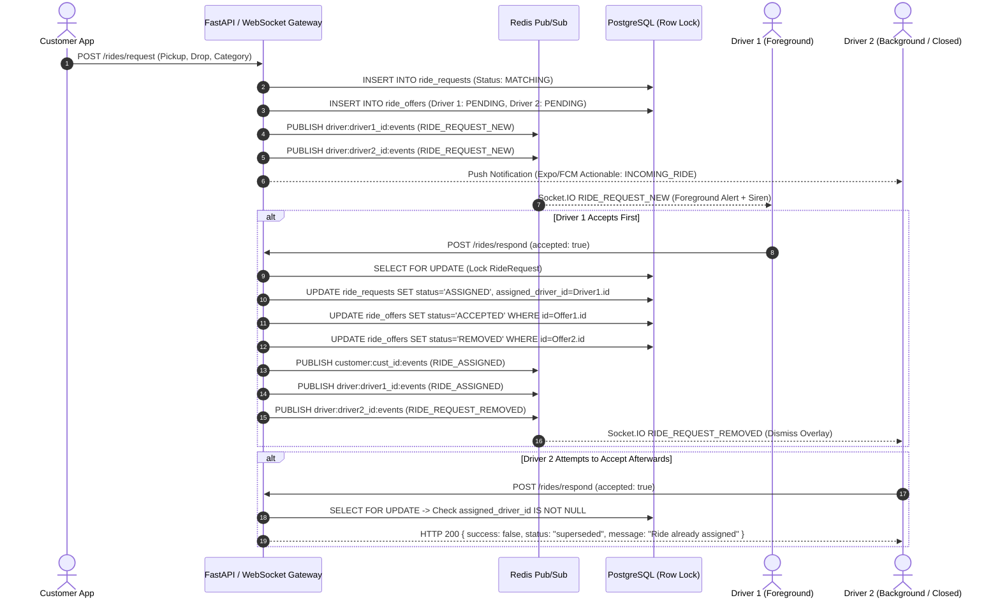

# 🚕 Production-Grade Driver Real-Time & Background Live Ride Dispatch Architecture

## Overview
This document describes the unified production-grade live ride dispatch system for **Driver App**, **Customer App**, and **FastAPI Backend / WebSocket Gateway**.

The architecture ensures **100% reliable request delivery** across all possible mobile application states:
1. **Foreground**: Instant sub-second delivery via private WebSocket rooms (`driver:{user_id}`).
2. **Background**: Actionable Push Notifications (FCM / APNs / Expo) with full trip context and action buttons.
3. **App-Killed / Closed**: Actionable Push Notification + instant database reconciliation via `GET /matching/rides/pending` on app launch.
4. **Network Reconnect / Weak Signal Recovery**: Automatic Socket.IO reconnection with exponential backoff + heartbeat + server-side pending & active state reconciliation.
5. **Atomic Acceptance (DB Concurrency Shield)**: Row-level locking (`SELECT ... FOR UPDATE`) guarantees only **ONE** driver wins any request. All losing offers are automatically marked `REMOVED`/`SUPERSEDED` and cleared from other drivers' radars via `RIDE_REQUEST_REMOVED`.

---

## Architecture Flow Diagram



---

## Core Endpoints Reference

### 1. Pending Request Recovery
- **`GET /matching/rides/pending`** (Aliases: `/rides/pending`, `/driver/ride-requests/pending`)
  - **Auth**: Driver Bearer Token
  - **Response**: Array of active, unexpired `PENDING` ride offers for this driver.
  - **Use Case**: Called on Driver App cold start, push notification open, or Socket.IO reconnect.

### 2. Active Ride Recovery
- **`GET /matching/rides/active`** (Alias: `/rides/active`)
  - **Auth**: Driver Bearer Token
  - **Response**: Active assigned ride or current offer.

### 3. Atomic Response
- **`POST /matching/rides/respond`** (Alias: `/rides/respond`)
  - **Payload**:
    ```json
    {
      "offer_id": "uuid-string",
      "accepted": true,
      "rejection_reason": null
    }
    ```
  - **Response on Success**:
    ```json
    {
      "success": true,
      "message": "Ride assigned successfully",
      "status": "assigned",
      "ride_request_id": "uuid-string"
    }
    ```
  - **Response when another driver already won**:
    ```json
    {
      "success": false,
      "message": "Ride already assigned to another driver",
      "status": "superseded"
    }
    ```

---

## WebSocket Gateway Events Reference

| Channel / Room | Direction | Event | Description |
| :--- | :--- | :--- | :--- |
| `driver:{user_id}` | Server → Driver | `DRIVER_SOCKET_READY` | Confirms driver private room entry upon JWT handshake |
| `driver:{user_id}` | Server → Driver | `RIDE_REQUEST_NEW` | Live incoming ride offer with full trip details, fare, timeout |
| `driver:{user_id}` | Server → Driver | `RIDE_REQUEST_REMOVED` | Dismisses request card when ride was claimed by another driver |
| `driver:{user_id}` | Server → Driver | `RIDE_ASSIGNED` | Confirmation event to the winning driver |
| `customer:{user_id}` | Server → Customer | `RIDE_ASSIGNED` | Confirms driver match with driver profile, rating, vehicle details |
| `ride:{ride_id}` | Bi-directional | `LOCATION_UPDATE` / `ride:location` | High-frequency driver GPS coordinate stream |
