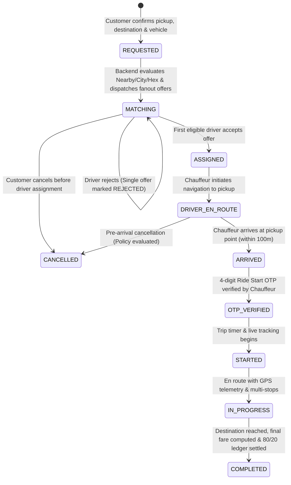

# Authoritative Ride State Machine & Operational Lifecycle

## 1. Cab / On-Demand Ride State Machine

---

## 2. Status Definitions & Invariants

| Status | Server Authority | Customer App View | Driver App View | Financial Action |
| :--- | :--- | :--- | :--- | :--- |
| `REQUESTED` / `MATCHING` | PostGIS / H3 dispatch fanout active | "Searching for drivers..." / "Connecting..." | Incoming Request Card (Countdown active) | Pre-authorized wallet hold / card token |
| `ASSIGNED` | Driver locked via conditional update | Chauffeur Card (Photo, Plate, Rating, ETA) | Job Assigned ("Navigate to Pickup") | None |
| `DRIVER_EN_ROUTE` | Driver GPS stream active | Live map with chauffeur approaching marker | Turn-by-turn navigation to pickup | None |
| `ARRIVED` | Chauffeur geofenced within 100m | Prominent 4-digit Ride Start PIN displayed | "Enter Passenger 4-Digit OTP" | Free waiting window timer starts |
| `STARTED` / `IN_PROGRESS` | OTP validated against `RIDE_START` | Live trip progress, ETA, SOS, Share link | In-trip navigation & multi-stop route | Trip meter accumulates distance/time |
| `COMPLETED` | Chauffeur swipes complete | Itemized Receipt & 5-Star Rating screen | Job Completed, Net Earnings credited | 80% credited to driver wallet, 20% commission |
| `CANCELLED` | Customer / Driver cancels | Cancellation confirmation & refund notice | Offer cleared / return to `SEARCHING` | 100% refund (if eligible) or cancellation fee |

---

## 3. 3 KM Proximity OTP Trigger Rule

1. **Trigger Condition**: When driver distance to pickup point $\le 3,000\text{ meters}$ (`haversineDistance(driver_coords, pickup_coords) <= 3.0`).
2. **OTP Purpose**: Dedicated `RIDE_START` context (distinct from authentication OTPs).
3. **Delivery**: Sent to customer via Socket.IO `OTP_READY` event and push notification.
4. **Validation**: Chauffeur submits 4-digit code $\to$ Server validates code, expiry (15 mins), and max attempt limit (3 attempts) before transitioning state to `STARTED`.
