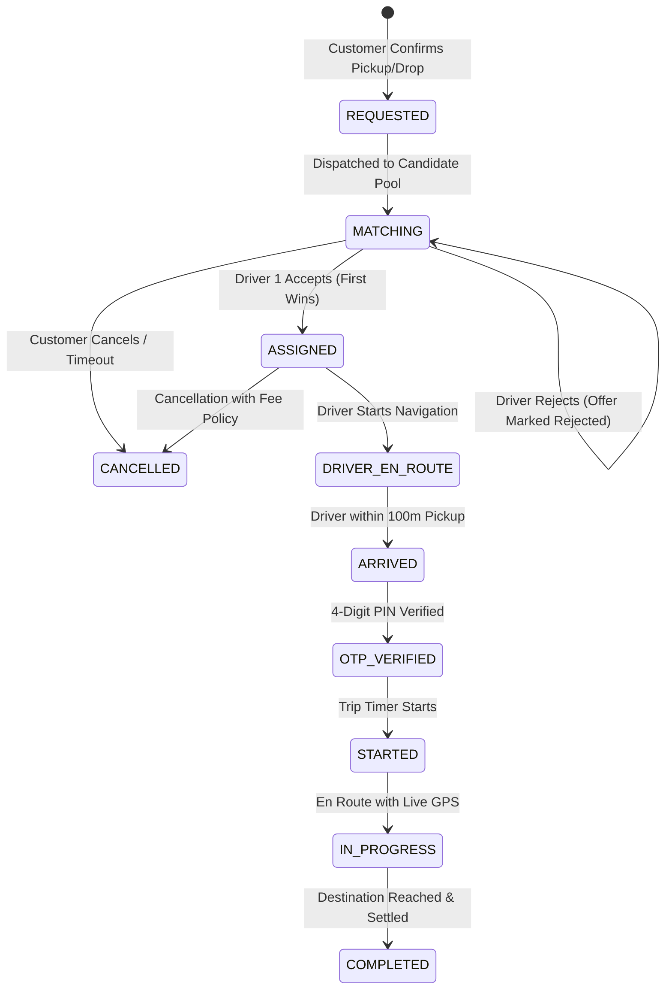
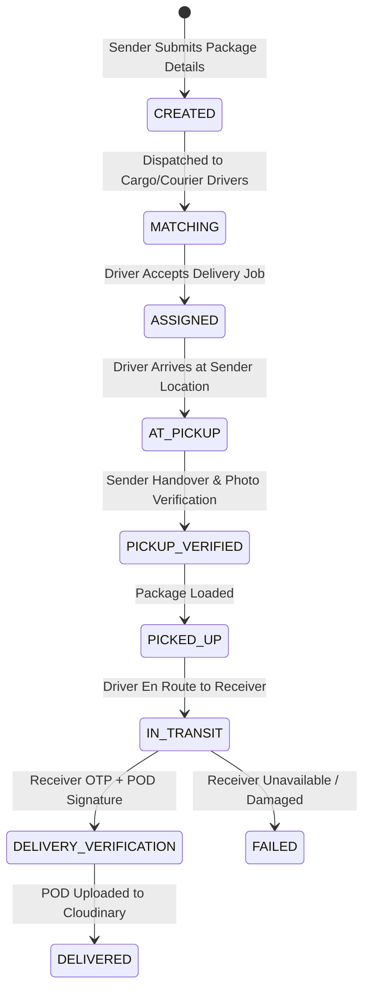
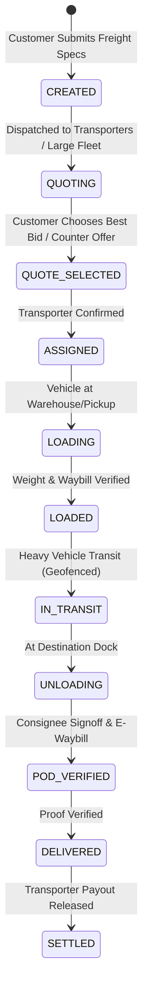
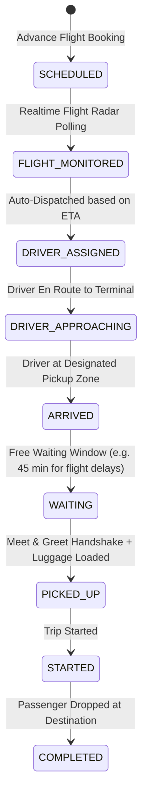
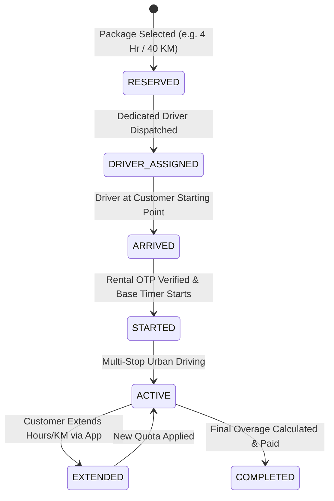
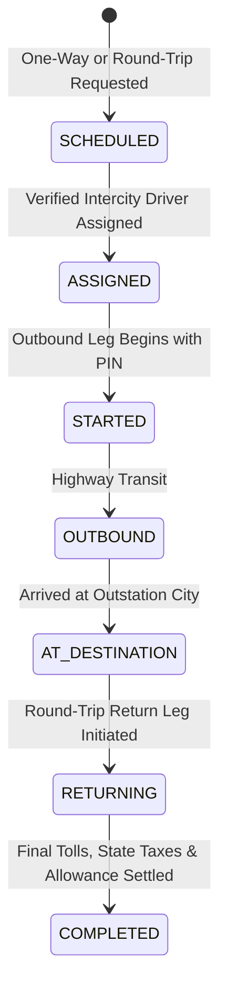
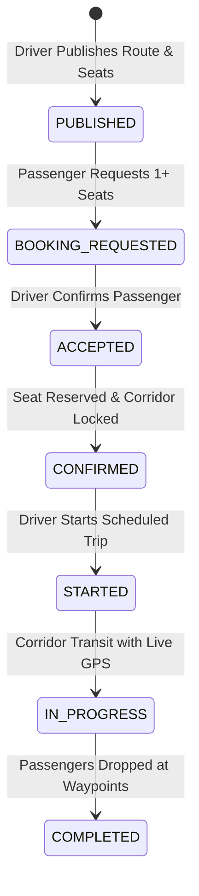
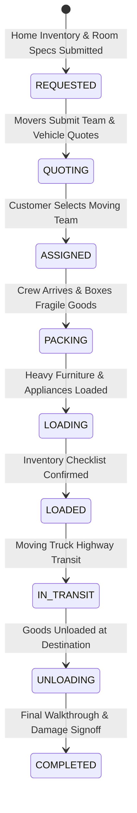
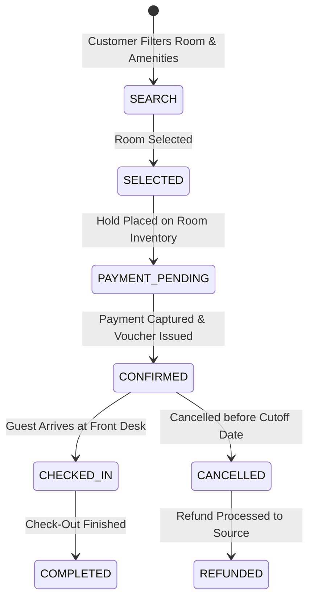
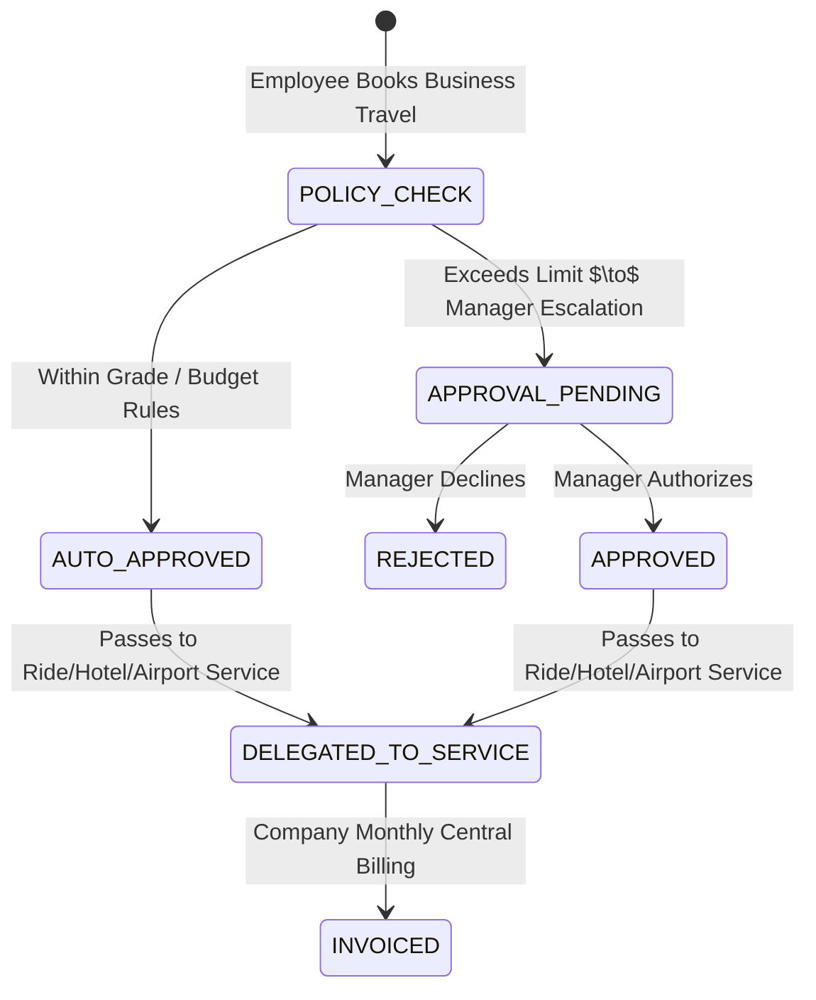

# Service State Machines & Transition Contracts

## Architectural Principle
The SuperApp **avoids a single monolithic status enum**. While all domains align with high-level lifecycle stages (`CREATED`, `MATCHING`, `ASSIGNED`, `ACTIVE`, `COMPLETED`, `CANCELLED`), each service executes its own distinct, server-authoritative business state machine.

---

## 1. Service 1 — Cab / On-Demand Ride (`ride_orders` / `ride_requests`)

- **Rollback / Cancel Policy**: Customer cancel before driver arrival = Free; Cancel after arrival / >5 min en route = Cancellation fee credited to driver ledger.
- **PIN Rule**: 4-digit PIN is generated on proximity ($\le 3000\text{ m}$) and required for transition to `STARTED`.

---

## 2. Service 2 — Parcel Logistics (`parcel_orders`)

- **POD Requirement**: Digital receiver signature + photo stored in Cloudinary with metadata recorded in `parcel_pod`.

---

## 3. Service 3 — Transport & Freight (`transport_orders`)

---

## 4. Service 4 — Airport Transport (`airport_bookings`)

---

## 5. Service 5 — Hourly Car Rental (`rental_orders`)

---

## 6. Service 6 — Outstation Multi-City (`outstation_orders`)

---

## 7. Service 7 — Intercity Carpool (`trips` & `bookings`)

---

## 8. Service 8 — Packers & Movers (`moving_orders`)

---

## 9. Service 9 — Hotel Booking (`hotel_bookings`)

---

## 10. Service 10 — Corporate Delegation (`corporate_bookings`)

